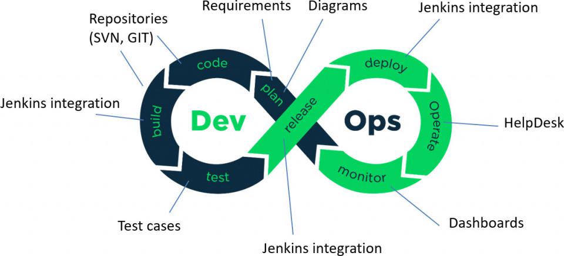

# DevOps
adasdewqagain
## Before DevOps:

- There was a blame culture between the teams
- Not smooth communication between Operations and Development

## What is DevOps:

- A specified team bridges the gap between operations and development
- Checks and tests things constantly
- Be able to understand the product built by other people; no need to understand how to build a product from scratch
- The environment should work for everyone
- Can be thought of as an extension of the agile method
- Changes in small increments and in iterations
- Continuous testing by developing automated [CI/CD pipelines](https://www.flagship.io/ci-cd/)

## Benefits:

- Everyone can use the same environment which reduces issues between teams
- It gets rid of blame culture, due to the rigorous resting
- People are more flexible so problems can be solved more easily
- Consistent communication between members
- The product theoretically gets better after each iteration

## 4 PILLARS:
- Ease of use; making an easy environment for everyone to use 
- Flexibility; can work on different things and understand most areas
- Robustness; fast solid delivery without much compromise
- Cost; it's cost effective

## Role of DevOps engineer
- The skills required are:
    - Communication
    - Experience with DevOps tools
    - Project Management
    - Optimizing release cycles
    - Coding knowledge (mainly OOP)
    - Infrastructure knowledge
- Writing documentation for features form teh server side
- Analysis of the current system and blueprinting/developing plans for enhancements and improvements (Mainly through automation)
- Cloud deployment and management
- CI/CD (continuous integration and deployment)
- Continuous testingat different stages of the development cycle

# How to initialise vagrant

- Create a directory
- Create a `.gitignore` (put `.vagrant/` and `.log` files as ignored)
- Create a `README.md`
- `vagrant init` *NAME OF OS*
- `rm -rf Vagrantfile`, and `nano` a new `Vagrantfile` with: 

    Vagrant.configure("2") do |config|

        config.vm.box = "ubuntu/xenial64"

    end

- `add`, `commit` and `push`
- `vagrant up` to get it running
- `vagrant ssh` to access shell
- ip is 192.168.10.100 when using nginx

# Bash
- `sudo` to run as admin
- `sudo` `apt-get update`, checks internet request
- `apt-get upgrade` will updrage the version
- `apt-get install` will install
- `apt-get install` will install, this case `nginx`, `-y` will automatically say yes
- check nginx status `systemctl status nginx` or `stop` or `start` or `restart` 
- who am I `uname` or `uname -a`
- where am I `pwd` 
- hwo to create a folder in linux `mkdir dir-name`
- how to check folder/file `ls` or `ls -a`
- .folders are hidden
- `cd` to change directory
- come out/back of/from the current location `cd ..`
- only `cd` will bring you to home directory
- `touch` to create a file
- `nano` will create file if it doesnt exist and lets you edit
- `vim` does the same thing
- `mv destination-path` to move files and folders
- to copy it's `cp path_of_data path_of_destination`
- 

#### File Permissions
- READ `r`
- WRITE `w`
- EXECUTE `x`
- how to check file permission `ll`
- change permission `chmod permission file-name`
- `chmod +x provision.sh` appended
- some numbers can be used as permissions
    -  - for images on vscode readme

## chmod Absolute Mode
 Uses octal numbers. 
- 4 = read 
- 2 = write 
- 1 = execute 
    - Add numbers of permissions you wish to grant. 
- Sum of these is what you provide. 
- Read, write, execute is 7 (4 + 2 + 1). 
- Read, write is 6 (4 + 2). 
    - Complete permissions are expressed as three-digit number. 
- Each digit corresponds to a context (owner, group, other).
    -  E.g. chmod 764 file1 (user = rwx, group = rw and others = read on file1)

           chmod 700 file1 (user = rwx)

           chmod 640 file1 (user = rw, group = r)

### Bash Scripting
- create a file called provision.sh (it can be called anything)
- change permission of this file `chmod +x provision.sh`
- first line *MUST BE* starting with `#!/bin/bash` (called a shebang)
- update and & upgrade
- installed nginx
- checked status
- start nginx
- `enable nginx` (makes it start automatically | optional)

- stopped then started
- To run our script `sudo ./provision.sh`

- create local provision.sh with the commands from before:
    #!/bin/bash

    ### update
    sudo apt-get update -y

    ### upgrade
    sudo apt-get upgrade -y

    ### install nginx
    sudo apt-get install nginx -y

    ### start nginx
    sudo systemctl start nginx

    ### enable nginx
    sudo systemctl enable nginx

- add this to Vagrantfile: `config.vm.provision "shell", path: "./provision.sh", run:"always"` (this executes local provisions file to the VM)

- uploading folder to vm using `config.vm.synced_folder "./app", "/home/vagrant/app"`

### Automated tasks
#### update
`sudo apt-get update -y`

#### upgrade
`sudo apt-get upgrade -y`

#### install nginx
`sudo apt-get install nginx -y`

#### start nginx
`sudo systemctl start nginx`

#### enable nginx
`sudo systemctl enable nginx`

#### download python stuff
`sudo apt-get install python-software-properties`

#### download v6
`curl -sL https://deb.nodesource.com/setup_6.x | sudo -E bash`

#### install node-js
`sudo apt-get install nodejs`

#### install pm2
`sudo npm install pm2 -g`

#### redirect to app folder
`cd app/app/`

#### npm install and -d to detach
`npm install -d`

#### start npm
`npm start`

### Creating Variables in Linux
- `MY_NAME=Shazid`
- `echo $MY_NAME` (will print the variable)
- There are a lot of preallocated variables and they can be called with `env`
- to create an environment variable:
    `export`
- E.g. `export MY_NAME` will add it to the environment variables
- `printenv *NAME OF VARIABLE*`
- sudo nano ~/.bashrc
- export [VARIABLE_NAME]=[variable_value]
- source ~/.bashrc
- sudo nano /etc/profile.d/[filename].sh
- unset [VARIABLE_NAME] to unset it
- 

### Reverse Proxy
- `sudo nano /etc/nginx/sites-available/default`
- location / {
        proxy_pass http://localhost:3000;
        proxy_http_version 1.1;
        proxy_set_header Upgrade $http_upgrade;
        proxy_set_header Connection 'upgrade';
        proxy_set_header Host $host;
        proxy_cache_bypass $http_upgrade;
    }
}
- `sudo nginx -t` to check for syntax errors
- `sudo systemctl restart nginx`
- cd
- `cd app/app npm start`

# # copying file to the folder location
# sudo cp app/default /etc/nginx/sites-available/default

# # ensuring there are no mistakes
# sudo nginx -t

# # ensuring nginx works fine
# sudo systemctl restart nginx
# sudo systemctl enable nginx

####
- How to find
- How to find out if processes are running:
    - `top` or `ps aux`
- How to kill a process `sudo kill process-id`
- How to use piping | to sort out or short list process
- How to use `head` and `tail`

#### mongodb
`sudo apt-get update -y`

`sudo apt-key adv --keyserver hkp://keyserver.ubuntu.com:80 --recv D68FA50FEA312927`

`echo "deb https://repo.mongodb.org/apt/ubuntu xenial/mongodb-org/3.2 multiverse" | sudo tee /etc/apt/sources.list.d/mongodb-org-3.2.list`

`sudo apt-get update -y`

`sudo apt-get upgrade -y`

##### sudo apt-get install mongodb-org=3.2.20 -y

`sudo apt-get install -y mongodb-org=3.2.20 `

`mongodb-org-server=3.2.20 mongodb-org-shell=3.2.20`
 
`mongodb-org-mongos=3.2.20 mongodb-org-tools=3.2.20`

##### if mongo is is set up correctly these will be successful
`nano /etc/mongod.conf` - write ip as 0.0.0.0

`sudo systemctl restart mongod`

`sudo systemctl enable mongod`

### What is Cloud Computing
- No Physical servers
- Can be accessed remotely
- Does not occupy physical space 

### Why would we use it
- cost effective
- fast
- reliable with multiple Availability Zones

- cant be scaled as easily

- AZs are Availability zones - the region is important, latency can be an issue
- Multiple AZs so there are options in case of emergencies and failures
- Traffic can be diverted to another AZ
- Highly available and scalable
- Users can be connected to the end-point

AWS:
- for tags eng114_shazid_nameofinstance

#### How to copy folder onto cloud vm
- scp -i eng114.pem -r C:/Users/SHAZID/Documents/DevOps_eng114/app user@awsdomain.com:/home/ubuntu/
- do the same things as vagrant, start and install nginx
- reverse proxy by going to root cd /, /etc/nginx/sites-available/default
- go into app folder, install npm and start
- can also use `nohup node app.js > /dev/null 2>&1 &`
- 

### Mongodb

In MongoDB
- start anoMongoDBstance in the same way for the mongodb vm
- use the provision script
- change default file in /etc/nginx/sites-available/ to have 0.0.0.0
- restart and enable mongod

In app
- `sudo echo "export DB_HOST=mongodb://IP/posts" >> ~/.bashrc`
- `source ~/.bashrc`
- `/app/app npm start`
- can also use this for running in the background `nohup node app.js > /dev/null 2>&1 &`

[2 Tier Architecture](/images/2_tier_architecture.png)

### How to Monitor and use Cloud Management
Monitoring & Alert Management

When should we monitor? If we have instances running

Who should be responsible? Developers and maintenance team

Who should be notified in case of failure? Maintenance team

What should be the next steps? IF the demand is too high, it can be autoscaled

Why should we Monitor? Fix live issues, and prevent long downtimes

What aspects should we monitor?

- error logs
- budgeting
- uptime - access time - response time - latency
- security breaches
- system test/health
- instance’s health
- CPU utilisation %
- There are 4 Golden Signals -

- need to have something to monitor
- see if there are any points of failure
- see if something is active or not
- monitor the health of the product (EC2 instance is running)
- Monitor if status code is not 200
- let us know what is wrong, trigger an alert message
- alert the on call staff

Monitoring and Alert Management Services:

- Cloudwatch to monitor AWS service - SNS simple notification service
- SQS simple queue service -

[AWS Diagram](/images/aws_diagram.png)

How to create alarms and notifications through SNS

- create topic
- create subscription
- confirm email
- go to instance and monitor
- select right topic and configuration

[Cloudwatch](/images/cloudwatch.png)

[Autoscaling](/images/autoscaling.png)

- scaled out as needed
- whoever is responsible for adjusting the load balancer decides the minimum, maximum and desired size
- Creating a template will save time

How to do it step by step:

- Need to create a launch template
- Select a type of LB (Load Balancer) - ALB Application Load Balancer: target group/listener group HTTP
- ALB = attach dependencies
- Auto-scaling group - attack this to ALB

DNS ADDRESS OF AUTOSCALING GROUP

USER DATA:

sudo apt-get update -y

sudo apt-get upgrade -y

sudo apt-get install nginx

sudo systemctl restart nginx

HOW TO SET UP ALERTS FOR the CPU usage

- cloudwatch
- all alarms
- create alarm
- EC2 and CPU metric
- use topic or create one

## What is a VPC

[AWS Network](/images/aws_network_diagram.png)

- Virtual Private Cloud
- Enables to launch AWS resources into a virtual network that has been defined by the user
- Similar to traditional networks used for own data centres but its also scalable
- On demand shared pool of resources allocated within a public cloud environment
- Isolation between VPC users is achieved through the allocation of private IP subnets and a virtual communication

You can create, access, and manage your VPCs using any of the following interfaces:

- **AWS Management Console** — Provides a web interface that you can use to access your VPCs.
- **AWS Command Line Interface (AWS CLI)** — Provides commands for a broad set of AWS services, including Amazon VPC, and is supported on Windows, Mac, and Linux. For more information, see [AWS Command Line Interface](https://aws.amazon.com/cli/).
- **AWS SDKs** — Provides language-specific APIs and takes care of many of the connection details, such as calculating signatures, handling request retries, and error handling. For more information, see [AWS SDKs](http://aws.amazon.com/tools/#SDKs).
- **Query API** — Provides low-level API actions that you call using HTTPS requests. Using the Query API is the most direct way to access Amazon VPC, but it requires that your application handle low-level details such as generating the hash to sign the request, and error handling. For more information, see [Amazon VPC actions](https://docs.aws.amazon.com/AWSEC2/latest/APIReference/OperationList-query-vpc.html) in the *Amazon EC2 API Reference*.

## What is an internet gateway

- An Internet gateway is a network "node" that connects two different networks that use different protocols (rules) for communicating. In the most basic terms, an Internet gateway is where data stops on its way to or from other networks. Thanks to gateways, we can communicate and send data back and forth with each other.
- An internet gateway **enables resources (like EC2 instances) in your public subnets to connect to the internet if the resource has a public IPv4 address or an IPv6 address**

## What is a subnet

- A subnet, or subnetwork, is a [network](https://www.cloudflare.com/learning/network-layer/what-is-the-network-layer/)
 inside a network. Subnets make networks more efficient. Through subnetting, network traffic can travel a shorter distance without passing through unnecessary [routers](https://www.cloudflare.com/learning/network-layer/what-is-routing/)
 to reach its destination.

[Subnet Diagram](/images/subnet_diagram.png)

## What is a CIDR block - how to create one

[Create an IPv4-enabled VPC and subnets using the AWS CLI](https://docs.aws.amazon.com/vpc/latest/userguide/vpc-subnets-commands-example.html)

Helpful to write a lot of addresses, CIDR works with binary notation

Provides unique addresses

# **CIDR Blocks**

The ability to group blocks of addresses into a single routing network is the hallmark of CIDR, and the prefix standard used for interpreting IP addresses makes this possible. CIDR blocks share the first part of the bit sequence that comprises the binary representation of the IP address, and blocks are identified using the same decimal-dot CIDR notation system that is used for IPv4 addresses. For example, 10.10.1.16/32 is an address prefix with 32 bits, which is the highest number of bits allowed in IPv4. Addresses with identical prefixes and the same number of bits always belong to the same block. In addition, larger blocks can be easily distinguished from smaller blocks by the length of the prefix. Short prefixes allow for more addresses while large prefixes identify small blocks.

CIDR notation is also used for the newer IPv6 standard, and the syntax is the same. The only difference is that IPv6 addresses may contain up to 128 bits instead of the 32-bit maximum of IPv4. Even though IPv6 addresses may be up to 128 bits in length, it is important to note that subnets on MAC layer networks always use 64-bit host identifiers.

## What is an NACLs - use case of NACL

A *network access control list (ACL)*
 is an optional layer of security for your VPC that acts as a firewall for controlling traffic in and out of one or more subnets. You might set up network ACLs with rules similar to your security groups in order to add an additional layer of security to your VPC

## **Network ACL basics**

The following are the basic things that you need to know about network ACLs:

- Your VPC automatically comes with a modifiable default network ACL. By default, it allows all inbound and outbound IPv4 traffic and, if applicable, IPv6 traffic.
- You can create a custom network ACL and associate it with a subnet. By default, each custom network ACL denies all inbound and outbound traffic until you add rules.
- Each subnet in your VPC must be associated with a network ACL. If you don't explicitly associate a subnet with a network ACL, the subnet is automatically associated with the default network ACL.
- You can associate a network ACL with multiple subnets. However, a subnet can be associated with only one network ACL at a time. When you associate a network ACL with a subnet, the previous association is removed.
- A network ACL contains a numbered list of rules. We evaluate the rules in order, starting with the lowest numbered rule, to determine whether traffic is allowed in or out of any subnet associated with the network ACL. The highest number that you can use for a rule is 32766. We recommend that you start by creating rules in increments (for example, increments of 10 or 100) so that you can insert new rules where you need to later on.
- A network ACL has separate inbound and outbound rules, and each rule can either allow or deny traffic.
- Network ACLs are stateless, which means that responses to allowed inbound traffic are subject to the rules for outbound traffic (and vice versa)

The following are the parts of a network ACL rule:

- **Rule number**. Rules are evaluated starting with the lowest numbered rule. As soon as a rule matches traffic, it's applied regardless of any higher-numbered rule that might contradict it.
- **Type**. The type of traffic; for example, SSH. You can also specify all traffic or a custom range.
- **Protocol**. You can specify any protocol that has a standard protocol number. For more information, see [Protocol Numbers](http://www.iana.org/assignments/protocol-numbers/protocol-numbers.xhtml). If you specify ICMP as the protocol, you can specify any or all of the ICMP types and codes.
- **Port range**. The listening port or port range for the traffic. For example, 80 for HTTP traffic.
- **Source**. [Inbound rules only] The source of the traffic (CIDR range).
- **Destination**. [Outbound rules only] The destination for the traffic (CIDR range).
- **Allow/Deny**. Whether to *allow* or *deny* the specified traffic.

### Steps

- Create a VPC in Ireland eu-west-1

- Create Internet Gateway (attach to the VPC)
    - Attach the internet gateway with own VPC
- Create a subnet/s - associate subnet with own VPC

- Create a route table
    - Edit route table to add rules to connect to IG (Internet Gateway)
    - associate subnet to VPC

### VPC DIAGRAM FOR MONGODB AND APP INSTANCES

